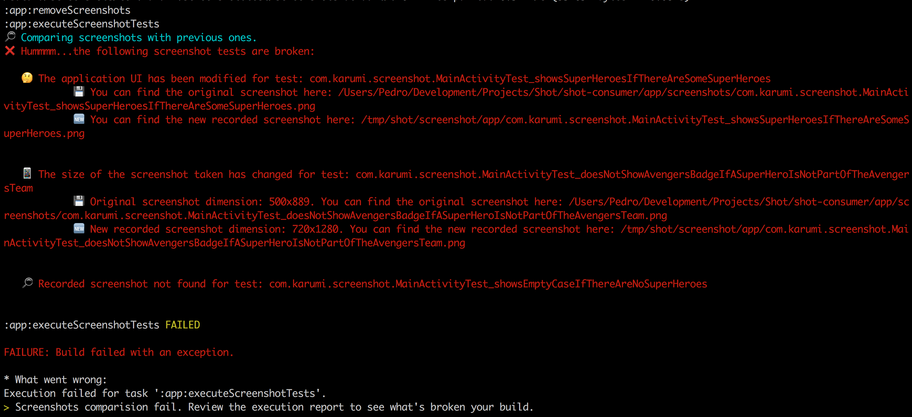

# ![Karumi logo][karumilogo]Shot [](https://travis-ci.org/Karumi/Shot)

Shot is a [Gradle](https://gradle.org/) plugin that simplifies the execution of screenshot tests using [Screenshot Tests For Android by Facebook](http://facebook.github.io/screenshot-tests-for-android/).

## What is this?

``Shot`` is a Gradle plugin thought to run screenshot tests for Android using the [screenshot testing Facebook SDK](http://facebook.github.io/screenshot-tests-for-android/).

Record your screenshots executing ``./gradlew executeScreenshotTests -Precord``


And verify your tests executing ``./gradlew executeScreenshotTests``


If Shot finds any error in your tests execution the Gradle plugin will show a report as follows:



**In a future PR we will generate a rich HTML report** 

You can find the complete Facebook SDK documentation [here](https://facebook.github.io/screenshot-tests-for-android/).

## Getting started

Setup the Gradle plugin:

```groovy
  buildscript {
    // ...
    dependencies {
      // ...
      classpath 'com.karumi:shot:0.1.1'
    }
  }
  apply plugin: 'shot'
  
  shot {
    appId = 'YOUR_APPLICATION_ID'
  }
```

This plugin sets up a few convenience commands you can list executing ``./gradlew tasks`` and reviewing the ``Shot`` associated tasks:

**If you are using flavors update your shot configuration inside the ``build.gradle`` file as follows:**


```groovy
  shot {
    appId = 'YOUR_APPLICATION_ID'
    instrumentationTestTask = 'connected<FlavorName><BuildTypeName>AndroidTest'
    packageTestApkTask = 'package<FlavorName><BuildTypeName>AndroidTest'
  }
```

The flavor used is the one selected to execute your screenshot tests.

An example could be:

```groovy
  shot {
    appId = 'com.my.app'
    instrumentationTestTask = 'connectedFreeAppDebugAndroidTest'
    packageTestApkTask = 'packageFreeAppAndroidTest'
  }
```

The screenshots library needs the ``WRITE_EXTERNAL_STORAGE`` permission. For an instrumentation test for a library, add this permission to the manifest of the instrumentation apk. For a test for an application, add this permission to the app under test. To grant this permission you can create an ``AndroidManifest.xml`` file inside the ``androidTest`` folder. Here you have an example:

```
<?xml version="1.0" encoding="utf-8"?>
<manifest xmlns:android="http://schemas.android.com/apk/res/android"
    package="<YOUR_APP_ID>.tests"
    android:sharedUserId="<YOUR_APP_ID>.uid">

    <uses-permission android:name="android.permission.WRITE_EXTERNAL_STORAGE" />

</manifest>
```

Remember to configure the instrumentation test runner in your ``build.gradle`` as follows:

```
android {
    ...
    defaultConfig {
        ...
        testInstrumentationRunner "com.myapp.ScreenshotTestRunner"
    }

```

Todo this you'll have to create a class named ``ScreenshotTestRunner`` like the following one inside your instrumentation tests source folder:
 
```java
public class ScreenshotTestRunner extends AndroidJUnitRunner {

    @Override
    public void onCreate(Bundle args) {
        super.onCreate(args);
        ScreenshotRunner.onCreate(this, args);
    }

    @Override
    public void finish(int resultCode, Bundle results) {
        ScreenshotRunner.onDestroy();
        super.finish(resultCode, results);
    }
}
```
 
Now you are ready to use the ``Screenshot`` API from your tests:

```java
@Test
public void theActivityIsShownProperly() {
        Activity mainActivity = startMainActivity();
       /*
         * Take the actual screenshot. At the end of this call the screenshot
         * is stored on the device, and the gradle plugin takes care of
         * pulling it and displaying it to you in nice ways.
         */
        Screenshot.snapActivity(activity).record();
} 
```

***You can find a complete example in this repository under the folder named ``shot-consumer`` or review [this kata](https://github.com/Karumi/KataScreenshotAndroid/).***

The [official documentation](https://facebook.github.io/screenshot-tests-for-android).

Now you are ready to record and verify your screenshot tests! 

## Recording tests

You can record your screenshot tests executing this command:

```
./gradlew executeScreenshotTests -Precord
```

This will execute all your integration tests and it will pull all the generated screenshots into your repository so you can easily add them to the version control system.

## Executing tests

Once you have a bunch of screenshot tests recorded you can easily verify if the behaviour of your app is the correct one executing this command:

```
./gradlew executeScreenshotTests
```

**After executing your screenshot tests using the Gradle task ``executeScreenshotTests`` a report with all your screenshots will be generated.**


[karumilogo]: https://cloud.githubusercontent.com/assets/858090/11626547/e5a1dc66-9ce3-11e5-908d-537e07e82090.png
